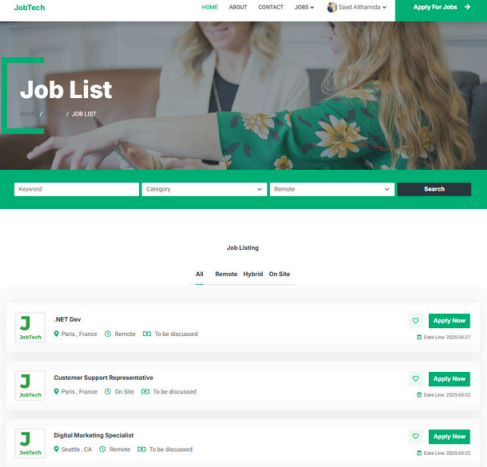
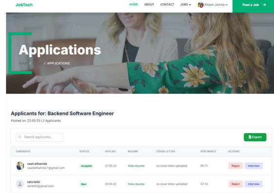
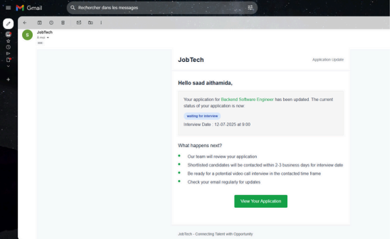

# 🤖 JobTech — AI-Powered Recruitment & Interview Management Platform

**JobTech** is a smart recruitment platform that empowers HR professionals to find the best talent by automating CV analysis, application scoring, and interview scheduling.  
It leverages **AI** and **natural language processing (NLP)** to extract meaningful data from resumes, match candidates with listings, and keep both recruiters and applicants in sync through smart **email notifications**.

---

## 🚀 What It Does

- Helps **HRs and recruiters** find the best match by scoring candidates based on extracted skills vs. job requirements.
- Keeps **applicants informed** with status updates, interview schedules, and reminders.
- Parses **CVs (PDF/DOCX)** to automatically extract experience, education, and skills using **SpaCy**.
- Enables **data export** (Excel, PDF) for reports and analysis.

---

## 🧠 Smart Features (AI)

- 📈 **Predictive Matching Score** — Compare skills from CVs with job requirements using NLP.
- 📄 **Automated CV Parsing** — Extracts candidate’s experience, education, and skills via SpaCy, PyPDF2, and Docx.
- 📊 **Statistical Reporting** — Generate performance & interview reports in PDF or Excel formats.
- ⏱️ **Email Notifications Scheduler** — Interview reminders sent 1 hour before the event using Celery + Redis.
- 📤 **Export to Excel** — Easily export candidate or interview data for further analysis.

---

## 📦 Traditional Features

- 🗂️ **Job Listings** — Recruiters can create, manage, and filter open job roles.
- 📬 **Apply to Jobs** — Applicants can upload a resume and a motivation letter directly.
- 🔐 **Role-Based Interface** — Custom dashboards for recruiters, HR, and candidates.
- 📝 **Application Tracking** — View status changes like “Under Review,” “Interviewed,” or “Accepted.”
- 📧 **Real-Time Email Updates** — Applicants receive instant notifications when their status changes.

---

## 🛠️ Tech Stack

- **Backend:** Django (Python)
- **Frontend:** Tailwind CSS, Alpine.js
- **Database:** MySQL
- **AI/NLP:** SpaCy, PyPDF2, python-docx, Pandas
- **Task Queue:** Celery + Redis
- **Email Service:** Django Mailer
- **Exports:** Pandas (Excel reports)

---

## 📸 Demo Screenshots

### 🗃️ Jobs Page


### 📥 Applications Table


### 📧 Email Notification Preview


---

## 📊 Output Formats

- `.xlsx` Excel files: for exporting applications, interview stats, and user activity
- `.pdf` reports (planned): candidate performance, interview outcomes

---

## 📬 Email Notifications

- 🔔 When application status changes (e.g. _Interview Scheduled_, _Rejected_, _Accepted_)
- ⏰ 1 hour before a scheduled interview:
  - Applicant receives an interview reminder
  - Interviewer gets a preparation alert

---

## ⚙️ Local Installation & Setup

```bash
# Clone the repo
git clone https://github.com/yourusername/jobtech.git
cd jobtech

# Create virtual environment
python -m venv env
source env/bin/activate  # or env\Scripts\activate on Windows

# Install dependencies
pip install -r requirements.txt

# Configure environment
cp .env.example .env
# Add DB credentials, email settings, etc.

# Run migrations
python manage.py migrate

# Run Redis server (in another terminal)
redis-server

# Start Celery worker
celery -A jobtech worker -l info

# Start Celery beat (scheduler)
celery -A jobtech beat -l info

# Run Django server
python manage.py runserver
Visit your app at: http://localhost:8000

```
## 🎯 Target Users
JobTech is ideal for:

- 🧑‍💼 HR Agencies & Recruiters managing large applicant pools
 
- 🧪 Developers building smart job-matching tools

- 🎓 Students applying to internships or jobs

- 🧑‍💻 Startups needing an in-house job listing platform with automation

## 🙌 Contributing
- Have an idea to improve JobTech?
- Pull requests are welcome! Feel free to fork the project and submit issues.

## 📄 License
- This project is open-source and available under the MIT License.


